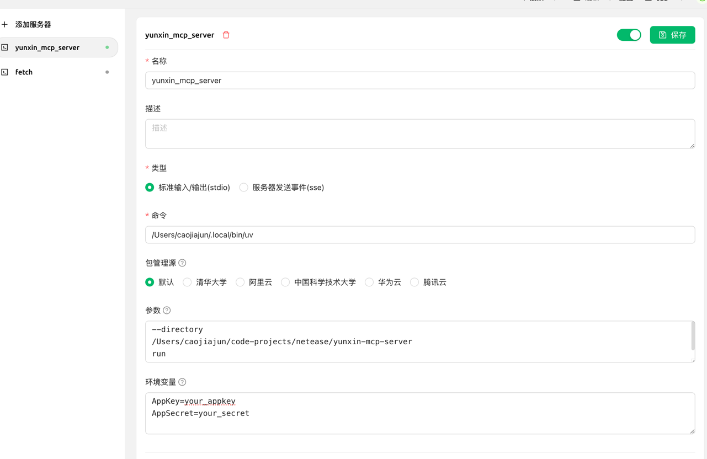

## 如何使用

你可以使用任意支持工具调用的大模型客户端以及大模型来使用yunxin_mcp_server

以下以deepseek和cherry-studio为例


### 下载cherry-studio

参考：[链接](https://cherry-ai.com/download)

### deepseek账号注册

参考：[链接](https://www.deepseek.com/)

### 配置mcp-server

参考：[链接](https://docs.cherry-ai.com/advanced-basic/mcp)

### 启用yunxin-mcp-server

因为yunxin-mcp-server尚未发布到python仓库，因此需要下载源码，并在本地启用

后续发布到python仓库后，以下步骤皆可省略：

* 下载源码

```
git clone https://github.com/netease-im/yunxin-mcp-server.git
```

* 安装uv

参考：[链接](https://docs.astral.sh/uv/)

* 在cherry中配置（注意替换为你自己uv目录和源码目录）



参数如下：
```
/Users/caojiajun/.local/bin/uv
```
```
--directory
/Users/caojiajun/code-projects/netease/yunxin-mcp-server
run
main.py
```
```
AppKey=your_appkey
AppSecret=your_secret
```

或者使用json配置：
```json
{
  "mcpServers": {
    "my_tool": {
      "isActive": true,
      "name": "yunxin_mcp_server",
      "type": "stdio",
      "registryUrl": "",
      "command": "/xxx/xxx/.local/bin/uv",
      "args": [
        "--directory",
        "/your_code-projects/yunxin-mcp-server",
        "run",
        "main.py"
      ],
      "env": {
        "AppKey": "xxxx",
        "AppSecret": "xxx"
      }
    }
  }
}
```

* 保存并启用